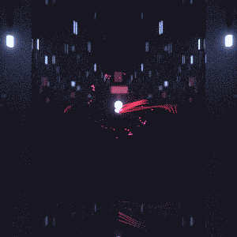

# Everyday One Motion - 20160915  

"Shiny IFS"  

  

JavaScript, WebGL, Raymarcher, Pathtracer  

[Everyday One Motion](http://motions.work/motion/402)  
[Demo Page](http://fms-cat-eom.github.io/20160915/dist)  

---

## あああああ

**これは自分用のメモです**  

### Background  

WebGLでレイマーチパストレやってる  

### Problem  

シェーダコンパイル時にChromeが死ぬ  
今までは、1サンプル分のレイマーチ・シェーディングをワンパスでやってた  
シェーダ重すぎだなオイ  

### Solution  

レイマーチ部とシェーディング部でシェーダ分けようぜ  
レイマーチ部を分離できれば、レイマーチ部のシェーダを分離してデプステストで処理とかできるんじゃね  

### レイマーチ -> パストレ  

- framebufferPos
  レイの位置 (vec3) : xyz
  レイの媒質内側・外側 (bool) : 0.0 < w
  レイの物体までの距離 (unsigned float) : abs( w )

- framebufferDir
  レイの向き (vec2 + bool) : xy, 0.0 < z

  あああああああああああああああああめんどい

---

## Type your text here

これはただの悪い夢だったんだ

[♪ Sigue Sigue Sputnik - 21st Century Boy](https://youtu.be/28hFIxgtv0o)

---

## あああああ (2)

**これは自分用のメモです**

1反射ごとに1パス使ってみよう〜〜〜〜  

### バッファに書き込むべきもの

- レイ位置
- レイ向き
- レイ媒質内側・外側
- 色Add (emissiveに命中して確定した色)
- 色Mul (まだ確定してない色、emissiveに命中したらこれと掛け算)
- 色Out (サンプリングが終了した色)
- デプス数
- サンプル数

### バッファ構成

|バッファ|x|y|z|w|
|:---|:---|:---|:---|:---|
|framebufferPos|rayPos.x|rayPos.y|rayPos.z|rayDir.x|
|framebufferAdd|colAdd.x|colAdd.y|colAdd.z|rayDir.y|
|frameBufferMul|colMul.x|colMul.y|colMul.z|depth * sign( rayDir.z )|
|framebufferOut|colOut.x|colOut.y|colOut.z|samples * rayInside ? -1.0 : 1.0|

色はすべて正に決っているため、符号にboolをぶち込むのはアリ
